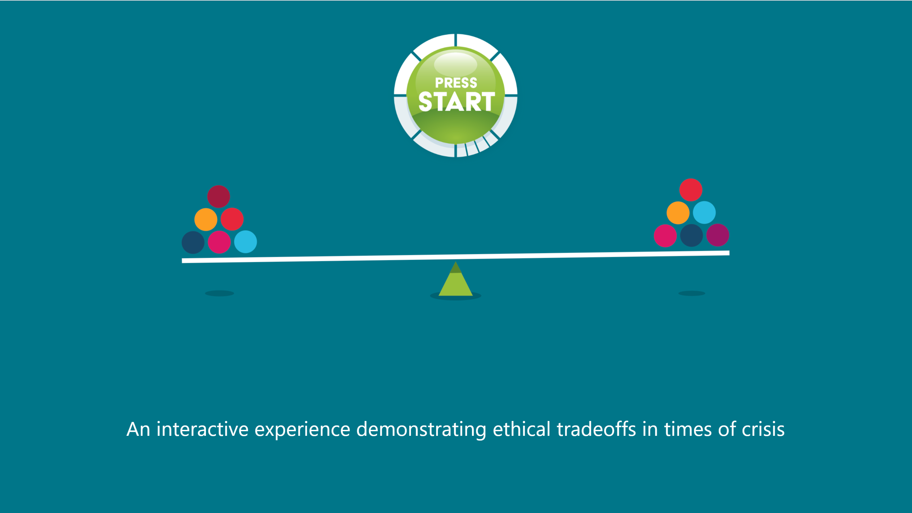

# seesaw
seesaw - an interactive experience demonstrating ethical tradeoffs in times of crisis.

See it live at [https://npaspallis.github.io/seesaw](https://npaspallis.github.io/seesaw)
The app is ideally displayed in `1920 x 1080` resolution.

## Build for Web

* Update the `version` in file `/lib/seesaw_app.dart`
* Run `flutter build web --base-href /seesaw/`

## Deploy on Web (github.io)

Copy the contents of `/build/web` to `/docs`